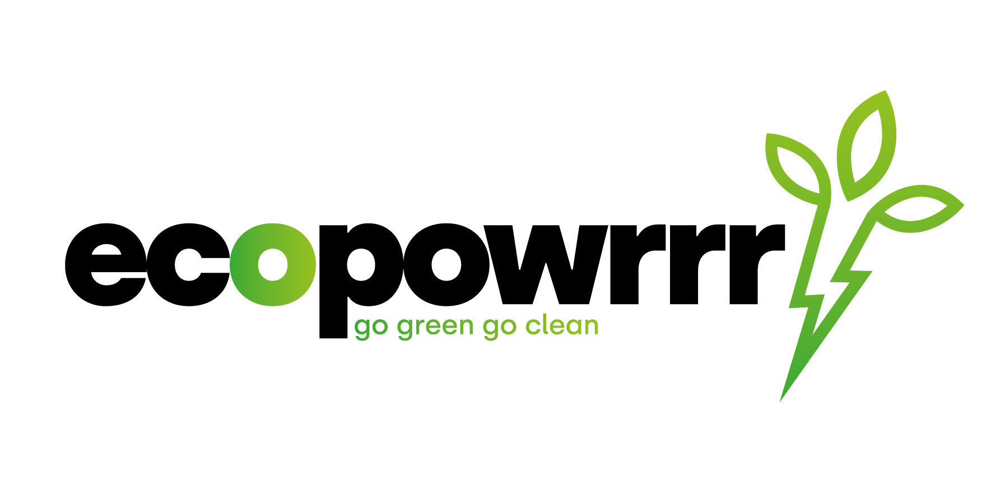

# ecopowrrr

**ecopowrrr** is een energieleverancier die 100% sustainable en renewable energie 
aanbiedt. Dit doen ze door het overschot dat huishoudens met warmtepompen en/of zonnepanelen opwekken in te kopen en vervolgens te verkopen aan hun klanten.

In **ecopowrrr** is een mock up gemaakt voor het api-oppervlak van de smart devices bij de klanten. Deze mock up is gemaakt met express.js. Voor de database is MongoDB gebruikt. Verder is de backend api ook gemaakt met express.js en MongoDB. 
